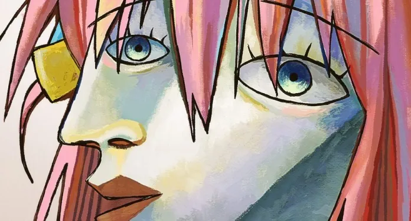

```powershell
> neofetch
```

 

<td valign="top" width="40%">


```yaml
Escarletx@github
-------------------------
Pronouns: She/Her
Location: Brazil (BRA)
OS Build: Windows 10
Shell: PowerShell / Warp / Git Bash
IDEs: Visual Studio / VS Code
Languages: C#, JavaScript, HTML, CSS
Frameworks: .NET, ASP.NET Core, Razor Pages, EF Core
Learning: Data Structures & Algorithms, DevOps, Cybersecurity, English
Hobbies: Reading, Gaming, Anime, Traveling
Status: Building backend applications & learning security
Discord: .xusz
```

<td>

``` powershell
> stack&tools 
```
<td align="center" valign="middle" width="30%">    
    
              
    
    
    
        
    
     
    
    
    
     
    
</td>
<br><br>

``` powershell
> projects 
```
<div align="center">
  <a href="https://github.com">
    
  </a>
  <p style="color: Yellow;">Comming soon...</p>
</div>
